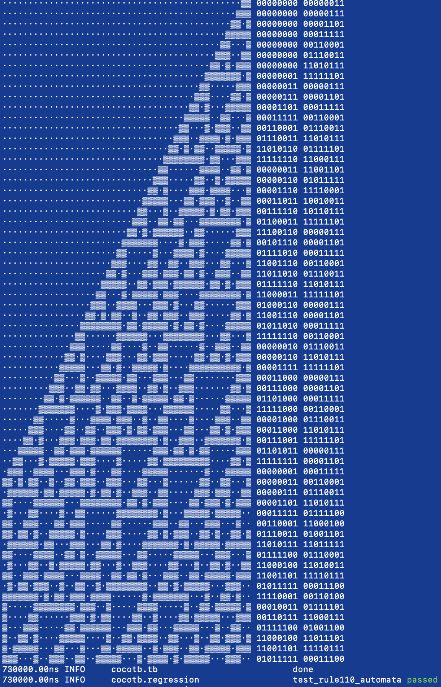

  

# Rule110 Cellular Automata

Cell parallel hardware implementation of the cellular automata in Verilog. One cycle - one evolution step across all cells.
This design executes **over 200 cells** of an elementary cellular automaton **every cycle** applying [Rule 110](https://en.wikipedia.org/wiki/Rule_110) to all of them **in parallel**.

## First success!

## GDS & Utilisation
Roughly 115 cells with parallel read/write bus can be placed on 1x1 TinyTapeout tile. Without read/write bus, up to 240 cells fit on a 1x1 tile!

Utilisation with parallel read/write bus, commit 6036188 (numbers for 2 tiles):
* NUM_CELLS =  232, Tile 1x2 :: Utilisation 59.8%, 2119 total cells, 234 DFFs, 356 MUXs, 281 BUFs
* NUM_CELLS =  224, Tile 1x2 :: Utilisation 57.2%, 2054 total cells, 226 DFFs, 272 MUXs, 322 BUFs
* NUM_CELLS =  128, Tile 1x2 :: Utilisation 30.8%, 1107 total cells, 130 DFFs, 180 MUXs, 128 BUFs
* NUM_CELLS =   64, Tile 1x2 :: Utilisation 15.8%,  567 total cells,  66 DFFs, 100 MUXs,  72 BUFs    

Utilisation without parallel read/write bus, commit 4254a88 (numbers for 1 tile):
* NUM_CELLS = 128, Tile 1x1 :: Utilisation 34.56%, 713 total cells, 129 DFFs
* NUM_CELLS =  32, Tile 1x1 :: Utilisation 10.49%, 232 total cells,  33 DFFs

## GDS with utilisation **59.8%** with 240 cells.

## What is Tiny Tapeout?

TinyTapeout is an educational project that aims to make it easier and cheaper than ever to get your digital designs manufactured on a real chip.

To learn more and get started, visit https://tinytapeout.com.

### Resources

- [FAQ](https://tinytapeout.com/faq/)
- [Digital design lessons](https://tinytapeout.com/digital_design/)
- [Learn how semiconductors work](https://tinytapeout.com/siliwiz/)
- [Join the community](https://discord.gg/rPK2nSjxy8)

### What next?

- Submit your design to the next shuttle [on the website](https://tinytapeout.com/#submit-your-design). The closing date is **November 4th**.
- Edit this [README](README.md) and explain your design, how it works, and how to test it.
- Share your GDS on Twitter, tag it [#tinytapeout](https://twitter.com/hashtag/tinytapeout?src=hashtag_click) and [link me](https://twitter.com/matthewvenn)!
