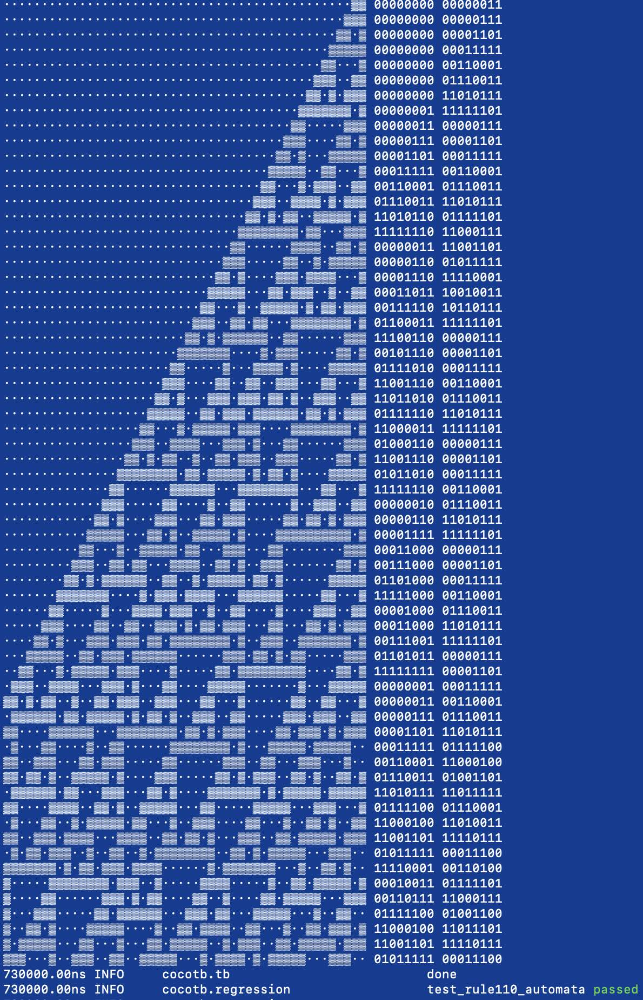
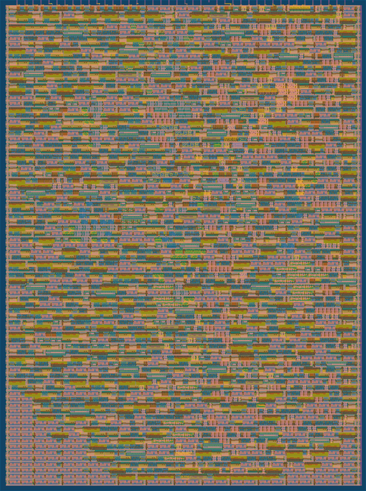

  

# Rule110 Cellular Automata ASIC for Tiny Tapeout 05

A parallel hardware implementation of the cellular automata in Verilog suitable for ASIC fabrication with [Tiny Tapeout](https://tinytapeout.com/)
This design executes **over 200 cells** of an elementary cellular automaton **every cycle** applying [Rule 110](https://en.wikipedia.org/wiki/Rule_110) to all of them **in parallel**.

One cycle - one evolution step across all cells at 50MHz!

## First success!


## GDS & Utilisation
Roughly 115 cells with parallel read/write bus can be placed on a single TinyTapeout tile. Without read/write bus, up to 240 cells fit on a single tile!

**Utilisation** with parallel read/write bus (numbers for 2 tiles):
* 232 cells, Tile 1x2 :: **59.84%**, 2119 total cells, 234 DFF, 356 MUX, 281 BUF, **commit 6036188**
* 224 cells, Tile 1x2 :: **57.19%**, 2054 total cells, 226 DFF, 272 MUX, 322 BUF, *commit 34538b6*
* 128 cells, Tile 1x2 :: **31.81%**, 1107 total cells, 130 DFF, 180 MUX, 128 BUF, *commit 89b27ec*
*  64 cells, Tile 1x2 :: **15.85%**,  567 total cells,  66 DFF, 100 MUX,  72 BUF, *commit b9ad400*

**Utilisation** without parallel read/write bus (numbers for 1 tile):
* 128 cells, Tile 1x1 :: **34.56%**, 713 total cells, 129 DFF, **commit 4254a88**
*  32 cells, Tile 1x1 :: **10.49%**, 232 total cells,  33 DFF, *commit e650da8*

## GDS with 240 cells and **59.84%** utilisation.


## TODO: compare performance with CPU

## Why Rule 110? Interesting facts about Rule 110

Rule 110 exhibits complex behavior on the boundary **between stability and chaos**. It could be explored for pseudo random number generator and data compression.

**Gliders** - periodic structures with complex behaviour, universal computation and self-reproduction can be implemented with Rule 110.

**Turing complete** - with a particular repeating background pattern Rule 110 is known to be Turing complete.
This implies that, in principle, **any** calculation or computer program can be simulated using such automaton!

An example of an interesting pattern developing after a couple hundred iterations:
```
X XXXXXX XX   XXX   XX X    XXXXXXX  X   XX X  XXXX   X  XX XXXXX
XXX    XXXX  XX X  XXXXX   XX     X XX  XXXXX XX  X  XX XXXXX   X
X X   XX  X XXXXX XX   X  XXX    XXXXX XX   XXXX XX XXXXX   X  XX
XXX  XXX XXXX   XXXX  XX XX X   XX   XXXX  XX  XXXXXX   X  XX XXX
  X XX XXX  X  XX  X XXXXXXXX  XXX  XX  X XXX XX    X  XX XXXXX  
 XXXXXXX X XX XXX XXXX      X XX X XXX XXXX XXXX   XX XXXXX   X  
XX     XXXXXXXX XXX  X     XXXXXXXXX XXX  XXX  X  XXXXX   X  XX X
XX    XX      XXX X XX    XX       XXX X XX X XX XX   X  XX XXXXX
 X   XXX     XX XXXXXX   XXX      XX XXXXXXXXXXXXXX  XX XXXXX    
XX  XX X    XXXXX    X  XX X     XXXXX            X XXXXX   X   X
XX XXXXX   XX   X   XX XXXXX    XX   X           XXXX   X  XX  XX
 XXX   X  XXX  XX  XXXXX   X   XXX  XX          XX  X  XX XXX XX 
XX X  XX XX X XXX XX   X  XX  XX X XXX         XXX XX XXXXX XXXXX
 XXX XXXXXXXXXX XXXX  XX XXX XXXXXXX X        XX XXXXXX   XXX    
XX XXX        XXX  X XXXXX XXX     XXX       XXXXX    X  XX X   X
XXXX X       XX X XXXX   XXX X    XX X      XX   X   XX XXXXX  XX
   XXX      XXXXXXX  X  XX XXX   XXXXX     XXX  XX  XXXXX   X XX 
  XX X     XX     X XX XXXXX X  XX   X    XX X XXX XX   X  XXXXX 
 XXXXX    XXX    XXXXXXX   XXX XXX  XX   XXXXXXX XXXX  XX XX   X 
XX   X   XX X   XX     X  XX XXX X XXX  XX     XXX  X XXXXXX  XXX
 X  XX  XXXXX  XXX    XX XXXXX XXXXX X XXX    XX X XXXX    X XX  
XX XXX XX   X XX X   XXXXX   XXX   XXXXX X   XXXXXXX  X   XXXXX X
XXXX XXXX  XXXXXXX  XX   X  XX X  XX   XXX  XX     X XX  XX   XXX
   XXX  X XX     X XXX  XX XXXXX XXX  XX X XXX    XXXXX XXX  XX  
  XX X XXXXX    XXXX X XXXXX   XXX X XXXXXXX X   XX   XXX X XXX  
 XXXXXXX   X   XX  XXXXX   X  XX XXXXX     XXX  XXX  XX XXXXX X  
XX     X  XX  XXX XX   X  XX XXXXX   X    XX X XX X XXXXX   XXX X
XX    XX XXX XX XXXX  XX XXXXX   X  XX   XXXXXXXXXXXX   X  XX XXX
 X   XXXXX XXXXXX  X XXXXX   X  XX XXX  XX          X  XX XXXXX  
XX  XX   XXX    X XXXX   X  XX XXXXX X XXX         XX XXXXX   X X
XX XXX  XX X   XXXX  X  XX XXXXX   XXXXX X        XXXXX   X  XXXX
 XXX X XXXXX  XX  X XX XXXXX   X  XX   XXX       XX   X  XX XX   
XX XXXXX   X XXX XXXXXXX   X  XX XXX  XX X      XXX  XX XXXXXX  X
XXXX   X  XXXX XXX     X  XX XXXXX X XXXXX     XX X XXXXX    X XX
   X  XX XX  XXX X    XX XXXXX   XXXXX   X    XXXXXXX   X   XXXX 
  XX XXXXXX XX XXX   XXXXX   X  XX   X  XX   XX     X  XX  XX  X 
 XXXXX    XXXXXX X  XX   X  XX XXX  XX XXX  XXX    XX XXX XXX XX 
XX   X   XX    XXX XXX  XX XXXXX X XXXXX X XX X   XXXXX XXX XXXXX
```

## How to use the chip once it is done?

### Reset sequence and automatic execution of the automaton
After RESET all cells will be set to 0 except the rightmost that is going to be 1. Automaton will immediately start running.
Automaton will produce new state iteration every cycle for all the cells in parallel. Automaton will continue running until
`halt automata, inverted` pin is pulled low.

The 10 first iteration of the automaton after **RESET**.
```
                                                    X
                                                   XX
                                                  XXX
                                                 XX X
                                                XXXXX
                                               XX   X
                                              XXX  XX
                                             XX X XXX
                                            XXXXXXX X
        automaton state on the             XX     XXX
      10th iteration after RESET  ---->   XXX    XX X
```

### Read automaton state

To read state of the cells, 1) pull `halt automata, inverted` pin low and 2) set the `cell block address` bits.

Cells are read in 8 cell blocks and are addressed sequentially from right to left. Adress #0 represents the rightmost 8 cells.
Adress #1 represents the cells from 16 to 9 on the rights and so forth.

```
        automaton state on the 
      10th iteration after RESET  ---->   XXX    XX X
      00000000  ...  00000000000000000000011100001101
      |      |              |       |       |       |
      [adr#14]  ...  [addr#3][addr#2][addr#1][addr#0]
          cells are addressed in blocks of 8 bits
```


The state of the 8 cells in the block will appear on the pins of `output` path once the `cell block address` is set.

```
Timing diagram

CLK   ___     ___     ___     ___     ___     ___           ___
   __/   \___/   \___/   \___/   \___/   \___/   \___ ... _/   \___
     |       |       |       |       |       |             |
     |       |       |       |       |       |             |

WRITE  ____                                                 _______
    \__HALT__________________________________________ ... _/ 

WRITE_______________  ______________  _______________
   _/ ADDR#0        \/ ADDR#1       \/ ADDR#2 

READ OUTPUT_______         ________        ________
   ______/00001101\_______/00000111\______/00000000\_  
              ^                ^
              |                |
	     these are the expected values on
	        the 10th cycle after RESET

      ____
      HALT  - halt automata, inverted
      ADDR# - cell block address bits 0..4

```

### (Over)write automaton state

To write state of the cells, 1) pull `halt automata, inverted` pin low, 2) set the `cell block address` bits,
3) set the new desired cell state on the `input` path pins and 4) finally pull `write enable, inverted` pin low.

Cells are updated in 8 cell blocks and are addressed sequentially from right to left. Adress #0 represents the rightmost 8 cells.
Adress #1 represents the cells from 16 to 9 on the rights and so forth.

```
Timing diagram

CLK   ___     ___     ___     ___     ___     ___           ___
   __/   \___/   \___/   \___/   \___/   \___/   \___ ... _/   \___
     |       |       |       |       |       |             |
     |       |       |       |       |       |             |
WRITE  ____                                                 _______
    \__HALT__________________________________________ ... _/ 

WRITE_______________  ______________  _______________
   _/ ADDR#0        \/ ADDR#1       \/ ADDR#2

WRITE INPUT_________  ______________  _____________
   __/ 00000111     \/ 11100110     \/ 11010111    \_

WRITE______  __    ________  __    ________  __    __ ... _________
           \_WE___/        \_WE___/        \_WE___/
                 wait 1 cycle    wait 1 cycle


               given the values written above
         the next 12 cycles of automaton execution

      [adr#14]  ...  [addr#3][addr#2][addr#1][addr#0]
      |      |              |       |       |       |
      00000000  ...  00000000110101111110011000000111
                             XX X XXXXXX  XX      XXX
                            XXXXXXX    X XXX     XX X
                           XX     X   XXXX X    XXXXX
                          XXX    XX  XX  XXX   XX   X
                         XX X   XXX XXX XX X  XXX  XX
                        XXXXX  XX XXX XXXXXX XX X XXX
                       XX   X XXXXX XXX    XXXXXXXX X
                      XXX  XXXX   XXX X   XX      XXX
                     XX X XX  X  XX XXX  XXX     XX X
10 cyles later ->   XXXXXXXX XX XXXXX X XX X    XXXXX
      __                             ____
      WE   - write enable, inverted, HALT - halt automata, inverted
      ADDR# - cell block address bits 0..4
```

## A description of what the I/O pins do
| INPUTs             | OUTPUTSs          | BIDIRECTIONAL I/O                    |
| ------------------ | ----------------- | ------------------------------------ |
| write cell 0 state | read cell 0 state | **/WE** - write enable, inverted     |
| write cell 1 state | read cell 1 state | **/HALT** - pause automata, inverted |
| write cell 2 state | read cell 2 state | *ADDR#* - cell block address bit 0   |
| write cell 3 state | read cell 3 state | *ADDR#* - cell block address bit 1   |
| write cell 4 state | read cell 4 state | *ADDR#* - cell block address bit 2   |
| write cell 5 state | read cell 5 state | *ADDR#* - cell block address bit 3   |
| write cell 6 state | read cell 6 state | *ADDR#* - cell block address bit 4   |
| write cell 7 state | read cell 7 state | none                                 |


## What is Tiny Tapeout?

TinyTapeout is an educational project that aims to make it easier and cheaper than ever to get your digital designs manufactured on a real chip.

To learn more and get started, visit https://tinytapeout.com.

### Resources

- [FAQ](https://tinytapeout.com/faq/)
- [Digital design lessons](https://tinytapeout.com/digital_design/)
- [Learn how semiconductors work](https://tinytapeout.com/siliwiz/)
- [Join the community](https://discord.gg/rPK2nSjxy8)

### What next?

- Submit your design to the next shuttle [on the website](https://tinytapeout.com/#submit-your-design). The closing date is **November 4th**.
- Edit this [README](README.md) and explain your design, how it works, and how to test it.
- Share your GDS on Twitter, tag it [#tinytapeout](https://twitter.com/hashtag/tinytapeout?src=hashtag_click) and [link me](https://twitter.com/matthewvenn)!
