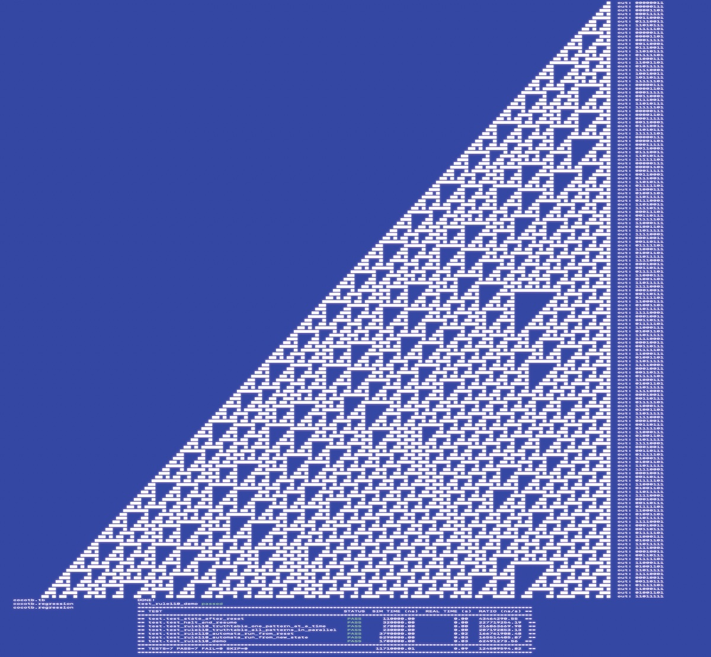
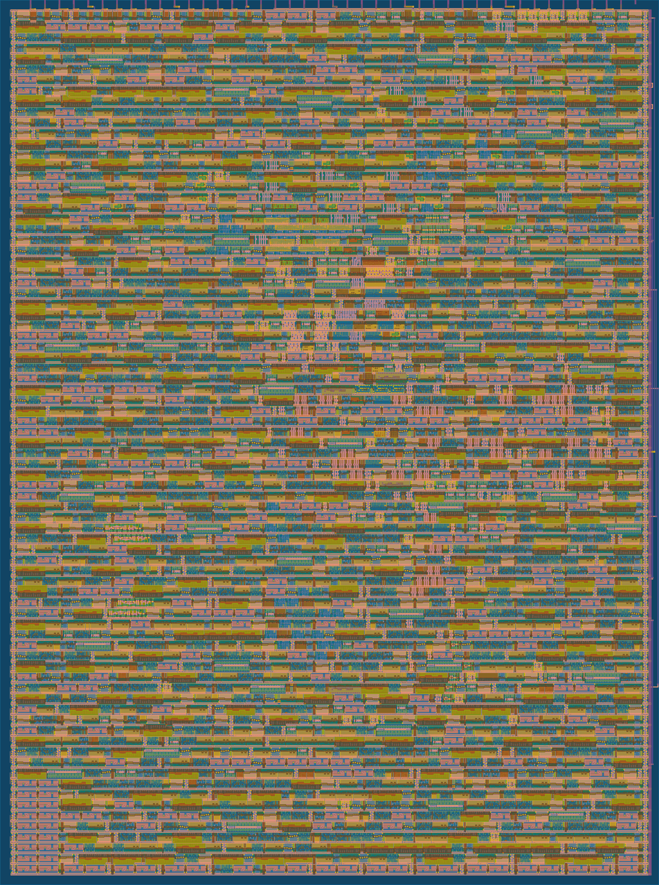

  

# Rule110 Cellular Automata ASIC for Tiny Tapeout 05

A parallel hardware implementation of the Cellular Automaton in Verilog suitable for ASIC fabrication with [Tiny Tapeout](https://tinytapeout.com/).

This design executes **256 cells** of an elementary cellular automaton **every cycle** applying [Rule 110](https://en.wikipedia.org/wiki/Rule_110) to all of them **in parallel**.

Each cycle - one evolution step across the whole cellular automaton at 50MHz!

## First success!


## ASIC area utilisation
Roughly 128 cells with parallel read/write bus can be placed on a single TinyTapeout tile. Without read/write bus, up to 256 cells fit on a single tile!

**Utilisation** with parallel read/write bus (numbers for 2 tiles):
* 256 cells, Tile 1x2 :: **64.19%**, 2213 logic of which 258 are Flip Flops, 455 MUX, 276 BUF, [**commit 737130c**](https://github.com/rejunity/tt05-rule110/commit/737130c)
* 240 cells, Tile 1x2 :: **60.72%**, 2109 logic of which 242 are Flip Flops, 426 MUX, 261 BUF, *commit 1d83f4c*
* 232 cells, Tile 1x2 :: **59.84%**, 2119 logic of which 234 are Flip Flops, 356 MUX, 281 BUF, *commit 6036188*
* 224 cells, Tile 1x2 :: **57.19%**, 2054 logic of which 226 are Flip Flops, 272 MUX, 322 BUF, *commit 34538b6*
* 128 cells, Tile 1x2 :: **31.81%**, 1107 logic of which 130 are Flip Flops, 180 MUX, 128 BUF, *commit 89b27ec*
*  64 cells, Tile 1x2 :: **15.85%**,  567 logic of which  66 are Flip Flops, 100 MUX,  72 BUF, *commit b9ad400*

**Utilisation** without parallel read/write bus (numbers for 1 tile):
* 128 cells, Tile 1x1 :: **34.56%**, 713 logic of which 129 are Flip Flops, **commit 4254a88**
*  32 cells, Tile 1x1 :: **10.49%**, 232 logic of which  33 are Flip Flops, *commit e650da8*

## ASIC fitting 256 automaton cells, **64.19%** of the chip is utilised by logic


## TODO: compare performance with CPU

Not validated yet, but intuition says performance of this ASIC @ 50Mhz should be comparable with a single CPU core @ 1Ghz running AVX SIMD implementation of a Rule 110.

## Interesting facts about Rule 110

Rule 110 exhibits complex behavior on the boundary **between stability and chaos**. It could be explored for pseudo random number generator and data compression.

[**Gliders**](https://en.wikipedia.org/wiki/Glider_(Conway%27s_Game_of_Life)) - periodic structures with complex behaviour, universal computation and self-reproduction can be implemented with Rule 110.

[**Turing complete**](https://en.wikipedia.org/wiki/Turing_completeness) - with a particular repeating background pattern Rule 110 is known to be Turing complete.
This implies that, in principle, **any** calculation or computer program can be simulated using such automaton!

[**Recurrent Neural Networks**](https://en.wikipedia.org/wiki/Recurrent_neural_network) - it can be shown that one dimensional Cellular Automaton is equivalent to a small **Recurrent Convolutional** Neural Network with [**Step activation**](https://en.wikipedia.org/wiki/Heaviside_step_function) funcion where neuron activations represent the state of the cells. Given the proof of Turing completness for Rule 110 and its complexity of behaviors, Cellular Automaton might be an interesting tool to model more advanced dynamics of Recurrrent nueral networks.

An example of an interesting pattern developing after a couple hundred iterations:
```
▓ ▓▓▓▓▓▓ ▓▓   ▓▓▓   ▓▓ ▓    ▓▓▓▓▓▓▓  ▓   ▓▓ ▓  ▓▓▓▓   ▓  ▓▓ ▓▓▓▓▓
▓▓▓    ▓▓▓▓  ▓▓ ▓  ▓▓▓▓▓   ▓▓     ▓ ▓▓  ▓▓▓▓▓ ▓▓  ▓  ▓▓ ▓▓▓▓▓   ▓
▓ ▓   ▓▓  ▓ ▓▓▓▓▓ ▓▓   ▓  ▓▓▓    ▓▓▓▓▓ ▓▓   ▓▓▓▓ ▓▓ ▓▓▓▓▓   ▓  ▓▓
▓▓▓  ▓▓▓ ▓▓▓▓   ▓▓▓▓  ▓▓ ▓▓ ▓   ▓▓   ▓▓▓▓  ▓▓  ▓▓▓▓▓▓   ▓  ▓▓ ▓▓▓
  ▓ ▓▓ ▓▓▓  ▓  ▓▓  ▓ ▓▓▓▓▓▓▓▓  ▓▓▓  ▓▓  ▓ ▓▓▓ ▓▓    ▓  ▓▓ ▓▓▓▓▓  
 ▓▓▓▓▓▓▓ ▓ ▓▓ ▓▓▓ ▓▓▓▓      ▓ ▓▓ ▓ ▓▓▓ ▓▓▓▓ ▓▓▓▓   ▓▓ ▓▓▓▓▓   ▓  
▓▓     ▓▓▓▓▓▓▓▓ ▓▓▓  ▓     ▓▓▓▓▓▓▓▓▓ ▓▓▓  ▓▓▓  ▓  ▓▓▓▓▓   ▓  ▓▓ ▓
▓▓    ▓▓      ▓▓▓ ▓ ▓▓    ▓▓       ▓▓▓ ▓ ▓▓ ▓ ▓▓ ▓▓   ▓  ▓▓ ▓▓▓▓▓
 ▓   ▓▓▓     ▓▓ ▓▓▓▓▓▓   ▓▓▓      ▓▓ ▓▓▓▓▓▓▓▓▓▓▓▓▓▓  ▓▓ ▓▓▓▓▓    
▓▓  ▓▓ ▓    ▓▓▓▓▓    ▓  ▓▓ ▓     ▓▓▓▓▓            ▓ ▓▓▓▓▓   ▓   ▓
▓▓ ▓▓▓▓▓   ▓▓   ▓   ▓▓ ▓▓▓▓▓    ▓▓   ▓           ▓▓▓▓   ▓  ▓▓  ▓▓
 ▓▓▓   ▓  ▓▓▓  ▓▓  ▓▓▓▓▓   ▓   ▓▓▓  ▓▓          ▓▓  ▓  ▓▓ ▓▓▓ ▓▓ 
▓▓ ▓  ▓▓ ▓▓ ▓ ▓▓▓ ▓▓   ▓  ▓▓  ▓▓ ▓ ▓▓▓         ▓▓▓ ▓▓ ▓▓▓▓▓ ▓▓▓▓▓
 ▓▓▓ ▓▓▓▓▓▓▓▓▓▓ ▓▓▓▓  ▓▓ ▓▓▓ ▓▓▓▓▓▓▓ ▓        ▓▓ ▓▓▓▓▓▓   ▓▓▓    
▓▓ ▓▓▓        ▓▓▓  ▓ ▓▓▓▓▓ ▓▓▓     ▓▓▓       ▓▓▓▓▓    ▓  ▓▓ ▓   ▓
▓▓▓▓ ▓       ▓▓ ▓ ▓▓▓▓   ▓▓▓ ▓    ▓▓ ▓      ▓▓   ▓   ▓▓ ▓▓▓▓▓  ▓▓
   ▓▓▓      ▓▓▓▓▓▓▓  ▓  ▓▓ ▓▓▓   ▓▓▓▓▓     ▓▓▓  ▓▓  ▓▓▓▓▓   ▓ ▓▓ 
  ▓▓ ▓     ▓▓     ▓ ▓▓ ▓▓▓▓▓ ▓  ▓▓   ▓    ▓▓ ▓ ▓▓▓ ▓▓   ▓  ▓▓▓▓▓ 
 ▓▓▓▓▓    ▓▓▓    ▓▓▓▓▓▓▓   ▓▓▓ ▓▓▓  ▓▓   ▓▓▓▓▓▓▓ ▓▓▓▓  ▓▓ ▓▓   ▓ 
▓▓   ▓   ▓▓ ▓   ▓▓     ▓  ▓▓ ▓▓▓ ▓ ▓▓▓  ▓▓     ▓▓▓  ▓ ▓▓▓▓▓▓  ▓▓▓
 ▓  ▓▓  ▓▓▓▓▓  ▓▓▓    ▓▓ ▓▓▓▓▓ ▓▓▓▓▓ ▓ ▓▓▓    ▓▓ ▓ ▓▓▓▓    ▓ ▓▓  
▓▓ ▓▓▓ ▓▓   ▓ ▓▓ ▓   ▓▓▓▓▓   ▓▓▓   ▓▓▓▓▓ ▓   ▓▓▓▓▓▓▓  ▓   ▓▓▓▓▓ ▓
▓▓▓▓ ▓▓▓▓  ▓▓▓▓▓▓▓  ▓▓   ▓  ▓▓ ▓  ▓▓   ▓▓▓  ▓▓     ▓ ▓▓  ▓▓   ▓▓▓
   ▓▓▓  ▓ ▓▓     ▓ ▓▓▓  ▓▓ ▓▓▓▓▓ ▓▓▓  ▓▓ ▓ ▓▓▓    ▓▓▓▓▓ ▓▓▓  ▓▓  
  ▓▓ ▓ ▓▓▓▓▓    ▓▓▓▓ ▓ ▓▓▓▓▓   ▓▓▓ ▓ ▓▓▓▓▓▓▓ ▓   ▓▓   ▓▓▓ ▓ ▓▓▓  
 ▓▓▓▓▓▓▓   ▓   ▓▓  ▓▓▓▓▓   ▓  ▓▓ ▓▓▓▓▓     ▓▓▓  ▓▓▓  ▓▓ ▓▓▓▓▓ ▓  
▓▓     ▓  ▓▓  ▓▓▓ ▓▓   ▓  ▓▓ ▓▓▓▓▓   ▓    ▓▓ ▓ ▓▓ ▓ ▓▓▓▓▓   ▓▓▓ ▓
▓▓    ▓▓ ▓▓▓ ▓▓ ▓▓▓▓  ▓▓ ▓▓▓▓▓   ▓  ▓▓   ▓▓▓▓▓▓▓▓▓▓▓▓   ▓  ▓▓ ▓▓▓
 ▓   ▓▓▓▓▓ ▓▓▓▓▓▓  ▓ ▓▓▓▓▓   ▓  ▓▓ ▓▓▓  ▓▓          ▓  ▓▓ ▓▓▓▓▓  
▓▓  ▓▓   ▓▓▓    ▓ ▓▓▓▓   ▓  ▓▓ ▓▓▓▓▓ ▓ ▓▓▓         ▓▓ ▓▓▓▓▓   ▓ ▓
▓▓ ▓▓▓  ▓▓ ▓   ▓▓▓▓  ▓  ▓▓ ▓▓▓▓▓   ▓▓▓▓▓ ▓        ▓▓▓▓▓   ▓  ▓▓▓▓
 ▓▓▓ ▓ ▓▓▓▓▓  ▓▓  ▓ ▓▓ ▓▓▓▓▓   ▓  ▓▓   ▓▓▓       ▓▓   ▓  ▓▓ ▓▓   
▓▓ ▓▓▓▓▓   ▓ ▓▓▓ ▓▓▓▓▓▓▓   ▓  ▓▓ ▓▓▓  ▓▓ ▓      ▓▓▓  ▓▓ ▓▓▓▓▓▓  ▓
▓▓▓▓   ▓  ▓▓▓▓ ▓▓▓     ▓  ▓▓ ▓▓▓▓▓ ▓ ▓▓▓▓▓     ▓▓ ▓ ▓▓▓▓▓    ▓ ▓▓
   ▓  ▓▓ ▓▓  ▓▓▓ ▓    ▓▓ ▓▓▓▓▓   ▓▓▓▓▓   ▓    ▓▓▓▓▓▓▓   ▓   ▓▓▓▓ 
  ▓▓ ▓▓▓▓▓▓ ▓▓ ▓▓▓   ▓▓▓▓▓   ▓  ▓▓   ▓  ▓▓   ▓▓     ▓  ▓▓  ▓▓  ▓ 
 ▓▓▓▓▓    ▓▓▓▓▓▓ ▓  ▓▓   ▓  ▓▓ ▓▓▓  ▓▓ ▓▓▓  ▓▓▓    ▓▓ ▓▓▓ ▓▓▓ ▓▓ 
▓▓   ▓   ▓▓    ▓▓▓ ▓▓▓  ▓▓ ▓▓▓▓▓ ▓ ▓▓▓▓▓ ▓ ▓▓ ▓   ▓▓▓▓▓ ▓▓▓ ▓▓▓▓▓
```

## How to use the chip once it is done?

### A description of I/O pins
| INPUTs             | OUTPUTSs          | BIDIRECTIONAL I/O                    |
| ------------------ | ----------------- | ------------------------------------ |
| write cell 0 state | read cell 0 state | **/WE** - write enable, inverted     |
| write cell 1 state | read cell 1 state | **/HALT** - pause automata, inverted |
| write cell 2 state | read cell 2 state | *ADDR#* - cell block address bit 0   |
| write cell 3 state | read cell 3 state | *ADDR#* - cell block address bit 1   |
| write cell 4 state | read cell 4 state | *ADDR#* - cell block address bit 2   |
| write cell 5 state | read cell 5 state | *ADDR#* - cell block address bit 3   |
| write cell 6 state | read cell 6 state | *ADDR#* - cell block address bit 4   |
| write cell 7 state | read cell 7 state | none                                 |

### Reset sequence and automatic execution of the automaton
After RESET all cells will be set to 0 except the rightmost that is going to be 1. Automaton will immediately start running.
Automaton will produce new state iteration every cycle for all the cells in parallel. Automaton will continue running until
`halt automata, inverted` pin is pulled low.

The 10 first iteration of the automaton after **RESET**.
```
                                                    ▓
                                                   ▓▓
                                                  ▓▓▓
                                                 ▓▓ ▓
                                                ▓▓▓▓▓
                                               ▓▓   ▓
                                              ▓▓▓  ▓▓
                                             ▓▓ ▓ ▓▓▓
                                            ▓▓▓▓▓▓▓ ▓
        automaton state on the             ▓▓     ▓▓▓
      10th iteration after RESET  ---->   ▓▓▓    ▓▓ ▓
```

### Read automaton state

To read state of the cells, 1) pull `halt automata, inverted` pin low and 2) set the `cell block address` bits.

Cells are read in 8 cell blocks and are addressed sequentially from right to left. Adress #0 represents the rightmost 8 cells.
Adress #1 represents the cells from 16 to 9 on the rights and so forth.

```
        automaton state on the 
      10th iteration after RESET  ---->   XXX    XX X
      00000000  ...  00000000000000000000011100001101
      |      |              |       |       |       |
      [adr#14]  ...  [addr#3][addr#2][addr#1][addr#0]
          cells are addressed in blocks of 8 bits
```


The state of the 8 cells in the block will appear on the pins of `output` path once the `cell block address` is set.

```
Timing diagram

CLK   ___     ___     ___     ___     ___     ___           ___
   __/   \___/   \___/   \___/   \___/   \___/   \___ ... _/   \___
     |       |       |       |       |       |             |
     |       |       |       |       |       |             |

WRITE  ____                                                 _______
    \__HALT__________________________________________ ... _/ 

WRITE_______________  ______________  _______________
   _/ ADDR#0        \/ ADDR#1       \/ ADDR#2 

READ OUTPUT_______         ________        ________
   ______/00001101\_______/00000111\______/00000000\_  
              ^                ^
              |                |
	     these are the expected values on
	        the 10th cycle after RESET

      ____
      HALT  - halt automata, inverted
      ADDR# - cell block address bits 0..4

```

### (Over)write automaton state

To write state of the cells, 1) pull `halt automata, inverted` pin low, 2) set the `cell block address` bits,
3) set the new desired cell state on the `input` path pins and 4) finally pull `write enable, inverted` pin low.

Cells are updated in 8 cell blocks and are addressed sequentially from right to left. Adress #0 represents the rightmost 8 cells.
Adress #1 represents the cells from 16 to 9 on the rights and so forth.

```
Timing diagram

CLK   ___     ___     ___     ___     ___     ___           ___
   __/   \___/   \___/   \___/   \___/   \___/   \___ ... _/   \___
     |       |       |       |       |       |             |
     |       |       |       |       |       |             |
WRITE  ____                                                 _______
    \__HALT__________________________________________ ... _/ 

WRITE_______________  ______________  _______________
   _/ ADDR#0        \/ ADDR#1       \/ ADDR#2

WRITE INPUT_________  ______________  _____________
   __/ 00000111     \/ 11100110     \/ 11010111    \_

WRITE______  __    ________  __    ________  __    __ ... _________
           \_WE___/        \_WE___/        \_WE___/
                 wait 1 cycle    wait 1 cycle


               given the values written above
         the next 12 cycles of automaton execution

      [adr#14]  ...  [addr#3][addr#2][addr#1][addr#0]
      |      |              |       |       |       |
      00000000  ...  00000000110101111110011000000111
                             ▓▓ ▓ ▓▓▓▓▓▓  ▓▓      ▓▓▓
                            ▓▓▓▓▓▓▓    ▓ ▓▓▓     ▓▓ ▓
                           ▓▓     ▓   ▓▓▓▓ ▓    ▓▓▓▓▓
                          ▓▓▓    ▓▓  ▓▓  ▓▓▓   ▓▓   ▓
                         ▓▓ ▓   ▓▓▓ ▓▓▓ ▓▓ ▓  ▓▓▓  ▓▓
                        ▓▓▓▓▓  ▓▓ ▓▓▓ ▓▓▓▓▓▓ ▓▓ ▓ ▓▓▓
                       ▓▓   ▓ ▓▓▓▓▓ ▓▓▓    ▓▓▓▓▓▓▓▓ ▓
                      ▓▓▓  ▓▓▓▓   ▓▓▓ ▓   ▓▓      ▓▓▓
                     ▓▓ ▓ ▓▓  ▓  ▓▓ ▓▓▓  ▓▓▓     ▓▓ ▓
10 cyles later ->   ▓▓▓▓▓▓▓▓ ▓▓ ▓▓▓▓▓ ▓ ▓▓ ▓    ▓▓▓▓▓
      __                             ____
      WE   - write enable, inverted, HALT - halt automata, inverted
      ADDR# - cell block address bits 0..4
```

## How to build and test design locally?

Follow the instructions from Tiny Tapeout's [Testing Your Design Guide](https://tinytapeout.com/hdl/testing/) and install required packages, first.

```
    sudo apt install iverilog verilator
    pip3 install cocotb pytest
```

Next run `make` from the `\src` folder. `make` will compile Verilog source and launch `cocotb` test suite.

```
    cd src
    make
```

You are done! Feel free to experiment with the code!


## What is Tiny Tapeout?

TinyTapeout is an educational project that aims to make it easier and cheaper than ever to get your digital designs manufactured on a real chip.

To learn more and get started, visit https://tinytapeout.com.

### Resources

- [FAQ](https://tinytapeout.com/faq/)
- [Digital design lessons](https://tinytapeout.com/digital_design/)
- [Learn how semiconductors work](https://tinytapeout.com/siliwiz/)
- [Join the community](https://discord.gg/rPK2nSjxy8)

### What next?

- Submit your design to the next shuttle [on the website](https://tinytapeout.com/#submit-your-design). The closing date is **November 4th**.
- Edit this [README](README.md) and explain your design, how it works, and how to test it.
- Share your GDS on Twitter, tag it [#tinytapeout](https://twitter.com/hashtag/tinytapeout?src=hashtag_click) and [link me](https://twitter.com/matthewvenn)!
